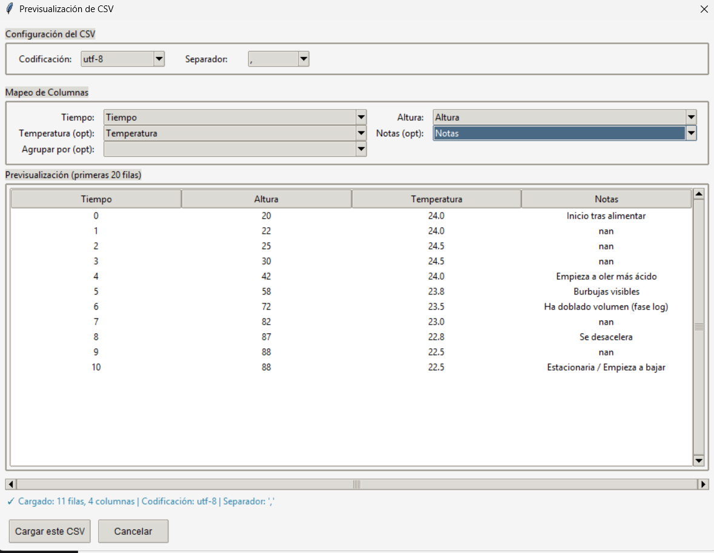
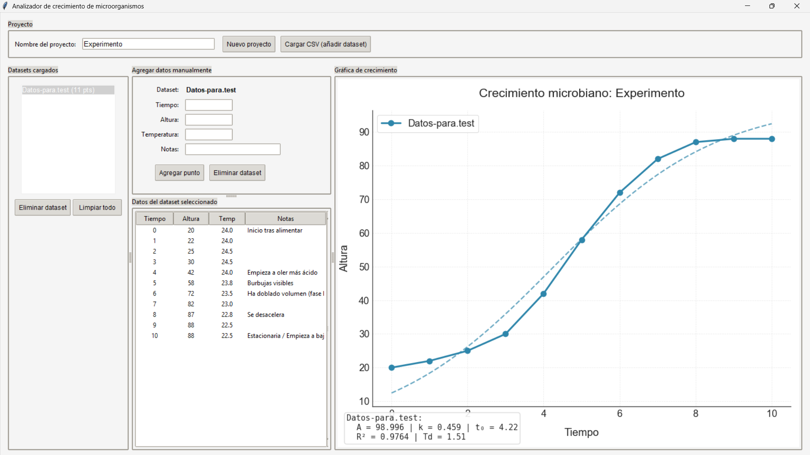

# Analizador de Crecimiento Bacteriano

**Desarrollado por Sebastian Porras Solano**  
*Herramienta de escritorio para microbiologos que prefieren analizar datos en lugar de luchar con archivos CSV.*

[](https://www.python.org/)
[](https://opensource.org/licenses/MIT)

## Acerca del Proyecto

**Analizador de Crecimiento Bacteriano** es una aplicacion grafica desarrollada en Python que facilita la visualizacion, el modelado matematico y la exportacion de curvas de crecimiento microbiano. Esta disenada para laboratorios de microbiologia, biotecnologia y areas afines que requieren procesar datos de densidad optica (OD), absorbancia o altura de colonias a lo largo del tiempo.

La aplicacion se distingue por su **previsualizador interactivo de archivos CSV**, el cual permite ajustar la codificacion y el separador sobre la marcha, eliminando los errores de formato antes de que los datos ingresen al sistema. Una vez cargados los datasets, el software calcula automaticamente medias, desviaciones estandar y ajusta un modelo logistico para obtener parametros cineticos de interes como la tasa maxima de crecimiento y el tiempo de duplicacion.

## Capturas de Pantalla

*Las imagenes deben almacenarse en una carpeta `screenshots` dentro de la raiz del repositorio.*

**Ventana de Previsualizacion de CSV**  
*Ajuste interactivo de codificacion y separador antes de la importacion.*  


**Panel de Analisis y Grafica de Crecimiento**  
*Modelado logistico, barras de error y visualizacion de multiples cepas.*  


## Caracteristicas Principales

- **Previsualizador Interactivo de CSV**  
  Deteccion automatica de codificacion (UTF-8, Latin-1, CP1252) y separadores (coma, punto y coma, tabulacion). El usuario puede modificar estos parametros en tiempo real y observar el efecto en las primeras 20 filas del archivo.

- **Manejo de Multiples Condiciones Experimentales**  
  Capacidad para cargar y visualizar simultaneamente multiples datasets (cepas, tratamientos o replicas biologicas). Cada dataset se identifica con un color unico y un nombre personalizado.

- **Calculo Automatico de Replicas**  
  Agrupacion inteligente de datos por punto temporal. Si existen varias mediciones para un mismo tiempo, la aplicacion calcula y grafica la media acompanada de su desviacion estandar.

- **Ajuste Logistico Profesional**  
  Aplicacion del modelo sigmoide `f(t) = A / (1 + e^(-k * (t - t0)))` mediante `scipy.optimize.curve_fit`. Proporciona:
  - **A**: Capacidad de carga (asintota maxima).
  - **k**: Tasa especifica maxima de crecimiento.
  - **t0**: Tiempo correspondiente al punto de inflexion.
  - **R²**: Coeficiente de determinacion del ajuste.
  - **Td**: Tiempo de duplicacion en fase exponencial (`ln(2)/k`).

- **Respaldo con Suavizado Savitzky-Golay**  
  Si los datos no presentan una forma sigmoide clasica o el ajuste logistico no converge, la aplicacion aplica silenciosamente un filtro de suavizado para generar una linea de tendencia visualmente coherente, evitando mensajes de error innecesarios.

- **Entrada Manual de Datos**  
  Interfaz para agregar o corregir puntos individuales directamente sobre el dataset seleccionado. Util para corregir valores atipicos o anadir mediciones omitidas sin necesidad de modificar el archivo original.

- **Exportacion de Calidad Cientifica**  
  - **Figuras**: Guardado en formatos PNG, PDF y SVG (ideal para publicaciones y posters).
  - **Datos**: Exportacion de datos agregados a archivos Excel (.xlsx) con hojas separadas por cepa y una hoja adicional con los parametros del ajuste logistico.

## Instalacion y Ejecucion

### Requisitos Previos
- Python 3.8 o superior instalado en el sistema.
- Gestor de paquetes `pip`.

### Paso 1: Clonar el Repositorio
```bash
git clone https://github.com/ImJustSebas/Analizador-de-crecimiento-bacteriano.git
cd Analizador-de-crecimiento-bacteriano
Paso 2: Instalar Dependencias
Se recomienda utilizar un entorno virtual para evitar conflictos con otros proyectos.

bash
pip install -r requirements.txt
Paso 3: Ejecutar la Aplicacion
bash
python Analizador-de-crecimiento-bacteriano.py
Guia de Uso Rapido
Asigne un nombre al proyecto en el campo correspondiente.

Presione "Cargar CSV (anadir dataset)" y seleccione el archivo deseado.

En la ventana de previsualizacion:

Verifique que las columnas de Tiempo y Altura se hayan identificado correctamente.

Si los caracteres no se muestran correctamente, pruebe cambiar la codificacion a Latin-1.

Si los datos aparecen en una sola columna, ajuste el separador (ej: ; o Tabulacion).

Repita el proceso para agregar mas datasets al proyecto.

Haga clic en "Analizar y Graficar".

Utilice los botones inferiores para Guardar la grafica o Exportar el informe a Excel.

Estructura Recomendada de los Archivos CSV
El programa realiza un mapeo flexible de nombres de columna. Sin embargo, para un reconocimiento automatico optimo, se sugiere que el archivo contenga:

Tiempo: Valores numericos (horas, minutos, dias).

Altura: Valores numericos (OD, absorbancia, mm).

Temperatura (Opcional): Valor numerico.

Notas (Opcional): Texto libre.

Ejemplo de formato valido:

Tiempo	Altura	Temperatura	Notas
0	0.102	37	Inoculo
2	0.145	37	
4	0.310	37	Inicio fase exp
Dependencias Principales
El archivo requirements.txt incluye las versiones compatibles de las siguientes bibliotecas:

Pandas: Procesamiento de datos tabulares.

NumPy: Operaciones numericas.

Matplotlib: Generacion de graficos de alta resolucion.

SciPy: Ajuste de curvas y filtros de suavizado.

Chardet: Deteccion automatica de codificacion de texto.

OpenPyXL: Soporte para escritura de archivos Excel (.xlsx).

Contacto
Autor: Sebastian Porras Solano

Correo Electronico: sebastianporras067@gmail.com

Perfil de GitHub: @ImJustSebas

Si este software le resulta util en su investigacion o practica profesional, considere dejar una estrella en el repositorio. Esto ayuda a que otros colegas puedan descubrirlo.
